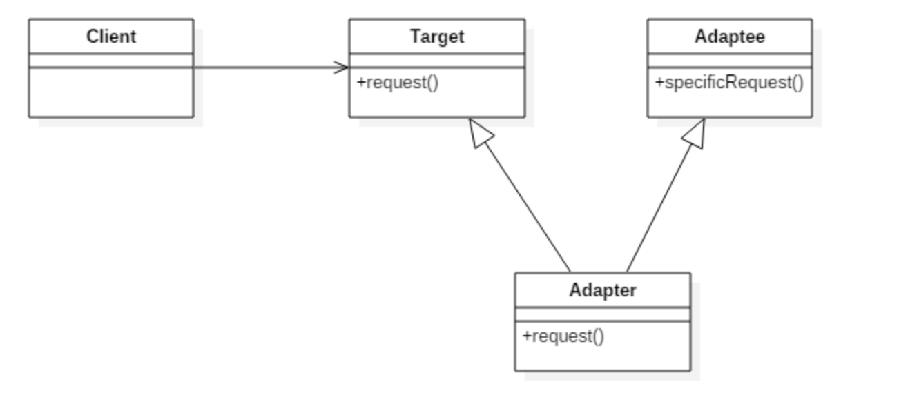
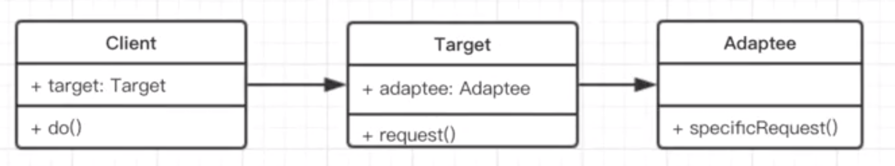

### 适配器模式

适配器模式将一个接口转换成客户希望的另一个接口, 适配器模式使接口不兼容的那些类可以一起工作, 其别名为包装器(`Wrapper`)。适配器模式既可以作为类结构型模式, 也可以作为对象结构型模式。

它是一种结构型设计模式。

### UML 类图

##### 传统的 Java 类图

##### JavaScript 类图

### 作用

使接口不兼容的对象能够相互合作。

### 优缺点

##### 优点

- 可以让任何两个没有关联的类一起运行 

- 提高了类的复用 

- 增加了类的透明度 

- 灵活性好

##### 缺点

- 一次至多只能适配一个适配者类

- 过多地使用适配器, 会让系统非常零乱, 不易整体进行把握

### 场景

- 旧接口的复用

- Vue Computed

### 参考

[适配器模式](https://zh.wikipedia.org/zh-hans/%E9%80%82%E9%85%8D%E5%99%A8%E6%A8%A1%E5%BC%8F)
