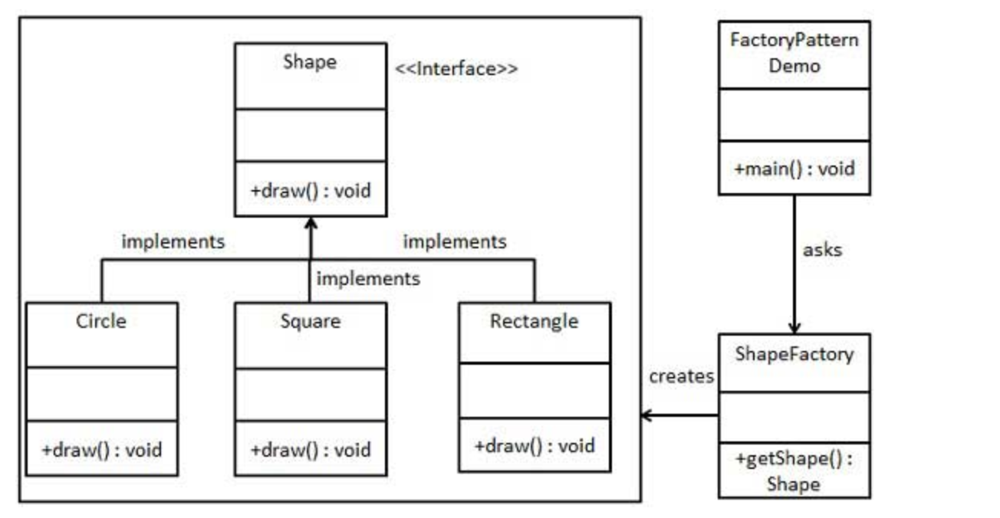
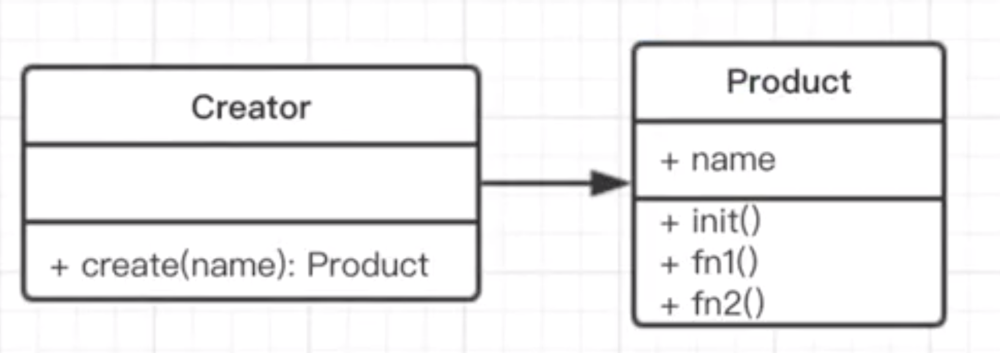

### 观察者模式

最常用的设计模式之一, 在工厂模式中, 我们在创建对象时不会对客户端暴露创建逻辑, 并且是通过使用一个共同的接口来指向新创建的对象。

### UML 类图

##### 传统的 Java 类图

##### JavaScript 类图

### 作用

定义一个创建对象的接口, 让其子类自己决定实例化哪一个工厂类, 工厂模式使其创建过程延迟到子类进行。

### 优缺点

##### 优点

- 解耦

- 扩展性高

- 降低代码重复

- 屏蔽产品的具体实现, 调用者只关心产品的接口

##### 缺点

- 增加产品, 需要修改工厂类, 不符合开放-封闭原则

- 工厂类集中了所有实例的创建逻辑, 违反了高内聚责任分配原则

### 场景

- React.createElement

- Vue 异步组件

### 参考

[工厂模式](https://zh.wikipedia.org/wiki/%E5%B7%A5%E5%8E%82%E6%96%B9%E6%B3%95)
