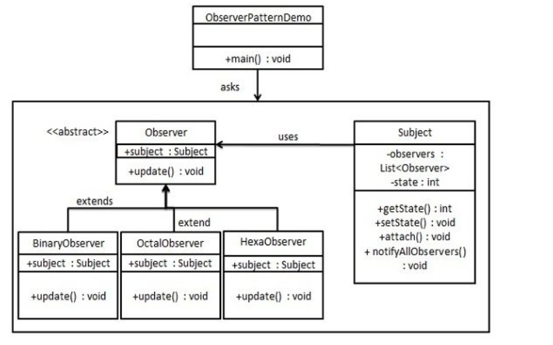
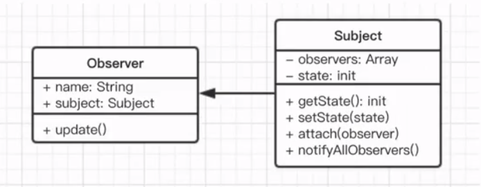

### 观察者模式

一个目标对象管理所有相依于它的观察者对象, 并且在它本身的状态改变时主动发出通知。

- 发布 & 订阅

- 一对 `n`

### UML 类图

##### 传统的 Java 类图

##### JavaScript 类图

### 作用

- 当抽象个体有两个互相依赖的层面时。封装这些层面在单独的对象内将可允许程序员单独地去变更与重复使用这些对象，而不会产生两者之间交互的问题。

- 当其中一个对象的变更会影响其他对象，却又不知道多少对象必须被同时变更时。

- 当对象应该有能力通知其他对象，又不应该知道其他对象的实做细节时。

### 优缺点

##### 优点

- 观察者和被观察者是抽象耦合的。

- 建立一套触发机制。

##### 缺点

- 循环依赖会导致系统崩溃。

- 观察者太多会浪费时间。

### 场景

- Vue watch

- React, Vue 组件生命周期的触发

- Nodejs 自定义事件

- 事件监听

### 参考

[观察者模式](https://zh.wikipedia.org/zh-cn/%E8%A7%82%E5%AF%9F%E8%80%85%E6%A8%A1%E5%BC%8F)
