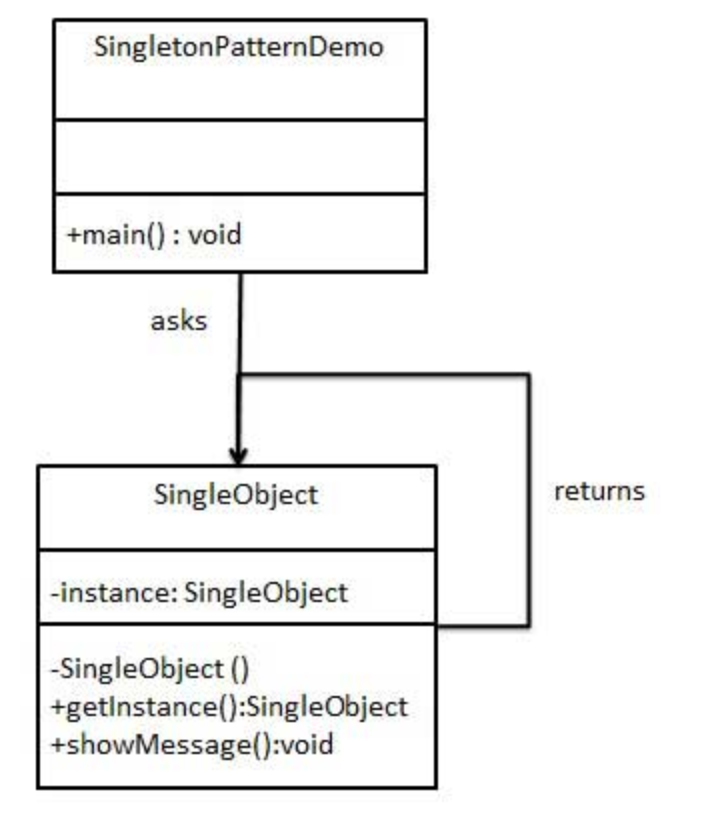

### 单例模式

单例模式(`Singleton Pattern`)是最简单的设计模式之一。这种类型的设计模式属于创建型模式, 它提供了一种创建对象的最佳方式。

这种模式涉及到一个单一的类, 该类负责创建自己的对象, 同时确保只有单个对象被创建。这个类提供了一种访问其唯一的对象的方式, 可以直接访问, 不需要实例化该类的对象。

- 单例类只能有一个实例。

- 单例类必须自己创建自己的唯一实例。

- 单例类必须给所有其他对象提供这一实例。

### 原理

一个类能返回对象一个引用(永远是同一个)和一个获得该实例的方法(必须是静态方法, 通常使用 `getInstance` 这个名称); 当我们调用这个方法时, 如果类持有的引用不为空就返回这个引用, 如果类保持的引用为空就创建该类的实例并将实例的引用赋予该类保持的引用; 同时我们还将该类的构造函数定义为私有方法, 这样其他处的代码就无法通过调用该类的构造函数来实例化该类的对象, 只有通过该类提供的静态方法来得到该类的唯一实例。

### UML类图

##### 传统的 Java 类图

### 场景

- Jquery

### 参考

[单例模式](https://zh.wikipedia.org/wiki/%E5%8D%95%E4%BE%8B%E6%A8%A1%E5%BC%8F)