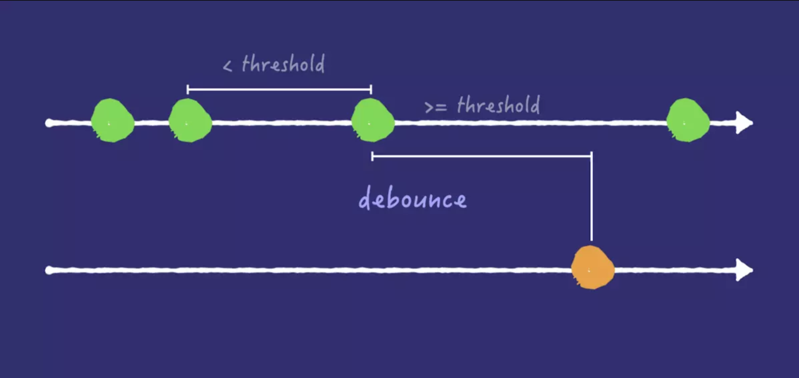

### 解题思路 or 实现原理

#### 防抖

- Lodash

从上一次被调用后, 延迟 `wait` 毫秒后调用 `func` 方法。 `debounced`(防抖动)函数提供一个 `cancel` 方法取消延迟的函数调用以及 `flush` 方法立即调用。 

- Ours

在事件被触发 `wait` 秒后, 再去执行回调函数。如果 `wait`秒内该事件被重新触发, 则重新计时。结果就是将频繁触发的事件合并为一次, 且在最后执行。提供一个 `cancel` 方法取消延迟的函数调用。

### 参考资料

[Debouncing and Throttling Explained Through Examples](https://css-tricks.com/debouncing-throttling-explained-examples/)
