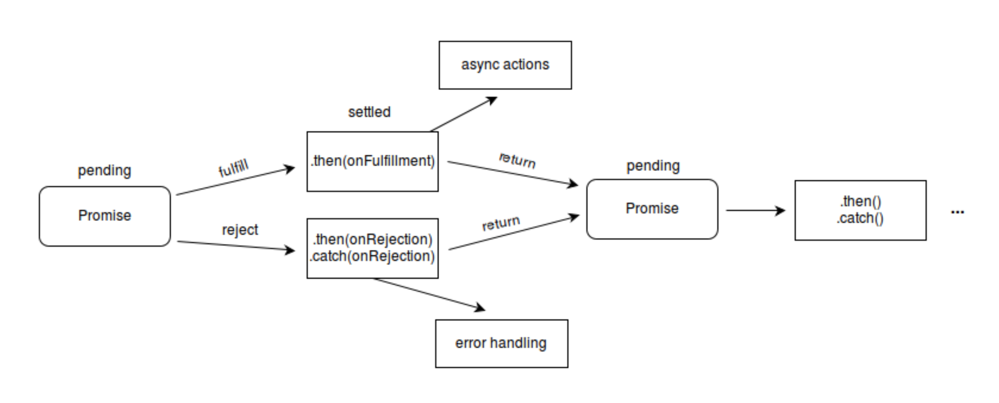

### 原理

`Promise` 对象是一个代理对象（代理一个值），被代理的值在`Promise`对象创建时可能是未知的。它允许你为异步操作的成功和失败分别绑定相应的处理方法`(handlers)`。 这让异步方法可以像同步方法那样返回值，但并不是立即返回最终执行结果，而是一个能代表未来出现的结果的`promise`对象。

Promise Process

<iframe src="https://promisesaplus.com/" width="100%" height="500px" frameborder="0" />

Promise A+

<iframe src="http://liubin.org/promises-book/" width="100%" height="500px" frameborder="0" />

JavaScript Promise 迷你书

### 参考

[Promises/A+规范](https://promisesaplus.com/) -> [【翻译】Promises/A+规范](https://www.ituring.com.cn/article/66566)

[Github Promise](https://github.com/then/promise) -> [Document](https://www.promisejs.org/)

[JavaScript Promise 迷你书](http://liubin.org/promises-book)

[MDN Promise](https://developer.mozilla.org/en-US/docs/Web/JavaScript/Reference/Global_Objects/Promise)

[手写实现满足 Promise/A+ 规范的 Promise](https://www.jianshu.com/p/8d5c3a9e6181)

[BAT 前端经典面试问题：史上最最最详细的手写 Promise 教程](https://juejin.im/post/5b2f02cd5188252b937548ab)

[MDN Promise.finally](https://developer.mozilla.org/zh-CN/docs/Web/JavaScript/Reference/Global_Objects/Promise/finally)
