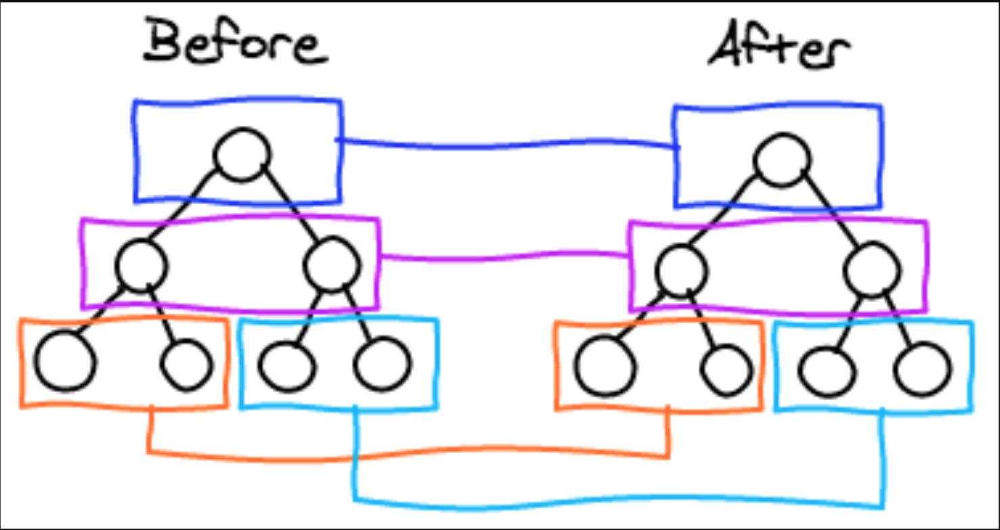

## 原理

### 通过 JavaScript对象来描述真实DOM

**我们通过@babel/plugin-transform-react-jsx 这个babel插件来完成这一步**

#### Example

**React**

**In**

```jsx
const profile = (
  <div>
    
    <h3>{[user.firstName, user.lastName].join(' ')}</h3>
  </div>
);
```

**Out**
```jsx
const profile = React.createElement("div", null,
  React.createElement("img", { src: "avatar.png", className: "profile" }),
  React.createElement("h3", null, [user.firstName, user.lastName].join(" "))
);
```
更多详情请移步 [@babel/plugin-transform-react-jsx](https://babeljs.io/docs/en/babel-plugin-transform-react-jsx/)

或者你也可以通过 `ES6`的`class`关键字来来描述`DOM`, 例子如下:

```js
class Element {
  type: string;
  props: Object<any>;
  children: Array<any>;

  constructor(type: stirng, props: Object<any>, children: Array<any>) {
    this.type = type;
    this.props = props;
    this.children = children;
  }
}
```

### 渲染真实DOM

#### [createElement()](./src/patch.js)

The javascript virtual dom renders to the HTML real dom.

```js
if (isString(node)) {
    return document.createTextNode(node + '');
  }
  const el = document.createElement(node.type);
  setProps(el, node.props || {});
  node.children &&
    node.children.map(createElement).forEach(el.appendChild.bind(el));

  return el;
```

### [Diff twice virtual dom](./src/diff.js)

```js
function diff(oldNode, newNode) {
  if (!oldNode) {
    return { type: CREATE, newNode };
  }

  if (!newNode) {
    return { type: REMOVE };
  }

  if (changed(oldNode, newNode)) {
    return { type: REPLACE, newNode };
  }

  if (oldNode.type !== newNode.type) {
    return {
      type: UPDATE,
      props: diffProps(oldNode.props, newNode.props),
      children: diffChildren(oldNode.children, newNode.children)
    };
  }
}
```

### [Patch twice virtual dom](./src/patch.js)

```js
function patch(parent, patches, index = 0) {
  if (!patches) {
    return;
  }
  const el = parent.children[index];

  switch (patches.type) {
    case CREATE: {
      const { newNode } = patches;
      const newEl = document.createElement(newNode);
      return parent.appendChild(newEl);
    }
    case REMOVE: {
      return parent.removeChild(el);
    }
    case REPLACE: {
      const { newNode } = patches;
      const newEl = createElement(newNode);
      return parent.replaceChild(newEl, el);
    }
    case UPDATE: {
      const { props, children } = patches;
      patchProps(el, props);
      children.forEach((child, idx) => {
        patch(el, child, idx);
      });
    }
  }
}
```

### 先序深度遍历



## Demo

[Link](https://rain120.github.io/vdom-diff-algorithm/)

## 参考

[React Diffing 算法](https://zh-hans.reactjs.org/docs/reconciliation.html#the-diffing-algorithm)

[React's diff algorithm - Christopher Chedeau](https://calendar.perfplanet.com/2013/diff/)

[React Dom Diff](https://sekaiamber.github.io/react-dom-diff/)

[virtual-dom](https://github.com/Matt-Esch/virtual-dom)

[How to write your own Virtual DOM](https://medium.com/@deathmood/how-to-write-your-own-virtual-dom-ee74acc13060)

[Under-the-hood-ReactJS](https://github.com/Bogdan-Lyashenko/Under-the-hood-ReactJS)

[babel-plugin-transform-react-jsx](https://babeljs.io/docs/en/babel-plugin-transform-react-jsx/)
