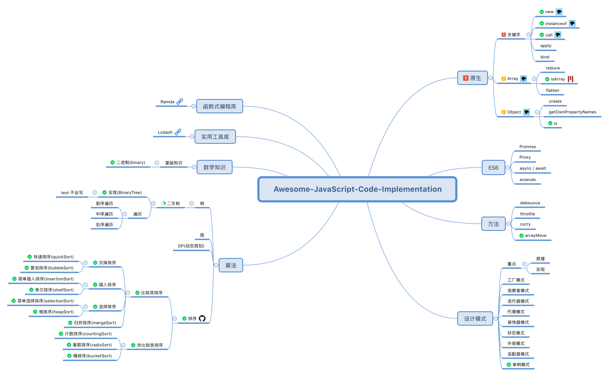

<h3 align="center">
  <a href="https://github.com/Rain120/awesome-javascript-code-implementation">非常好的Javascript源码实现</a>
</h3>

  

   

## 😚 欢迎

欢迎来到 JavaScript **源码实现**现场和我们一起学习编程 😁😁.

[EN Version](README.md)

#### 🎮 TL;DR

⌨️

[如何写文档?](docs/zh/how-to-write-docs/README.md)

#### ✍ 为什么我要做这个?

- 学习 **Typescript**, **Jest** 等知识.
- 学习一些常见的 **Javascript 源码实现**.

#### 💻 规划

[Xmind 下载地址](plans.xmind)

#### 🔨 使用

⌨️ 正在拼命开发中...

#### 🤝 贡献 

我们非常欢迎您来贡献. 你可以通过 [Pull Requests](https://github.com/Rain120/awesome-javascript-code-implementation/pulls) 或者 [GitHub Issue](https://github.com/Rain120/awesome-javascript-code-implementation/issues)来给我提建议、代码`bug`.

#### 🔗 快速链接

- [ ] Primitive

  - [ ] Javascript Keys

    - [x] [instanceof](src/instanceof/README.md)

    - [x] [new](src/new/README.md)

  - [ ] Array

    - [x] [isArray](src/Array/isArray/README.md)

  - [ ] Object

    - [x] [is](src/Object/README.md)

- [ ] ES6

  - [ ] Promise

  - [ ] Proxy

  - [ ] async / await

  - [ ] extends

- [ ] 方法

  - [x] [debounce](src/function/debounce/README.md)

  - [x] [throttle](src/function/throttle/README.md)

  - [ ] curry

  - [x] arrayMove

- [ ] Algorithm

  - [x] Sort

    - [x] [bubbleSort](src/Algorithm/sort/bubbleSort/README.md)

    - [x] [countingSort](src/Algorithm/sort/countingSort/README.md)

    - [x] [heapSort](src/Algorithm/sort/heapSort/README.md)

    - [x] [insertionSort](src/Algorithm/sort/insertionSort/README.md)

    - [x] [mergeSort](src/Algorithm/sort/mergeSort/README.md)

    - [x] [quickSort](src/Algorithm/sort/quickSort/README.md)

    - [x] [shellSort](src/Algorithm/sort/shellSort/README.md)

    - [x] [selectionSort](src/Algorithm/sort/selectionSort/README.md)

    - [x] [radixSort](src/Algorithm/sort/radixSort/README.md)

    - [x] [bucketSort](src/Algorithm/sort/bucketSort/README.md)

  - [ ] DP

  - [ ] Tree

    - [x] [binaryTree](src/Algorithm/binaryTree/README.md)

  - [ ] Graph

- [ ] Math

  - [x] [binary](src/Algorithm/binary/README.md)

- [ ] 实用工具库

  - [ ] Lodash

    - [ ] Internal

      - [x] BaseFindIndex

- [ ] 函数式编程库

  - [ ] Ramda

#### 📰 参考资料

- 算法

  [数据结构和算法动态可视化](https://visualgo.net/)

  [Data Structure Visualizations](https://www.cs.usfca.edu/~galles/visualization/Algorithms.html)

  [javascript-algorithms](https://github.com/trekhleb/javascript-algorithms)

- 排序

  [十大经典排序算法](https://github.com/Rain120/JS-Sorting-Algorithm)

  [JS 数组排序性能分析](https://dailc.github.io/jsfoundation-perfanalysis/html/performanceAnalysis/demo_performanceAnalysis_jsarraySort.html)

#### 👨‍🏭 作者

> 前端开发小菜鸡, 技术栈是 React + Typescript + Mobx, 也用过一点 Vue + Vuex.

- [Github](https://github.com/Rain120)
- [知乎](https://www.zhihu.com/people/yan-yang-nian-hua-120/activities)
- [掘金](https://juejin.im/user/57c616496be3ff00584f54db)

#### 📝 License

[MIT](https://github.com/Rain120/awesome-javascript-code-implementation/blob/master/LICENSE)

Copyright © 2019-present [Rain120](https://github.com/Rain120).
